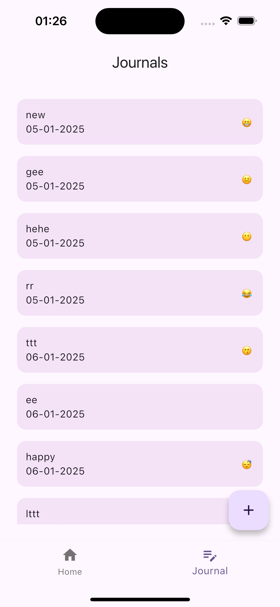

# Wearable

A proof-of-concept system that integrates health metrics(e.g., steps, heart rate, sleep) with
journaling data and presents them in an intuitive dashboard. The app should demonstrate a modular,
efficient, and offline-capable design while leveraging Flutter's capabilities for seamless UI and
functionality.

## Design

Design inspiration was entirely by me

## Features

1. Onboard through three(3) onboarding pages
2. Add journal by inputting an entry, mood and date
3. View journal data metrics on dashboard

## Screenshots

|                  Onboarding Screen - 1                   |                  Onboarding Screen - 2                   | 
|:--------------------------------------------------------:|:--------------------------------------------------------:|  
|  |  |

|                  Onboarding Screen - 3                   |                   Dashboard Screen                    | 
|:--------------------------------------------------------:|:-----------------------------------------------------:|  
|  |  |

|                  Dashboard Screen - 2                   |                   Journal Screen                    | 
|:-------------------------------------------------------:|:---------------------------------------------------:|  
|  |  |

|                   Add Journal Screen                    |                 Motivational message and step                 | 
|:-------------------------------------------------------:|:-------------------------------------------------------------:|  
|  |  |

